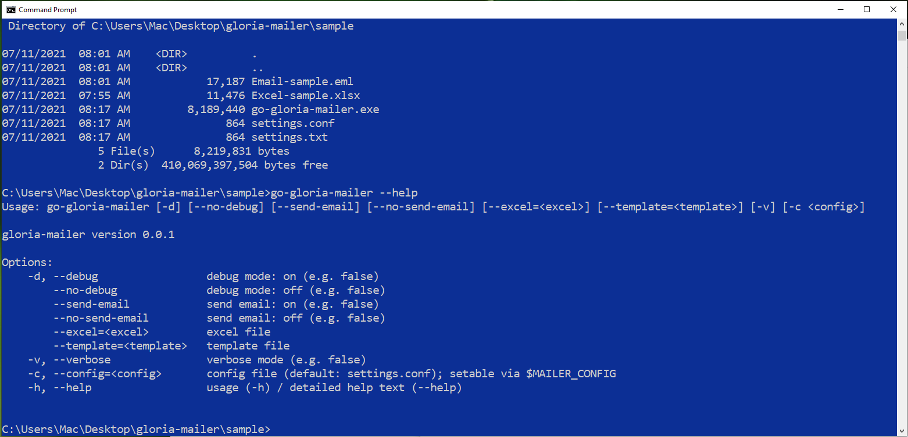
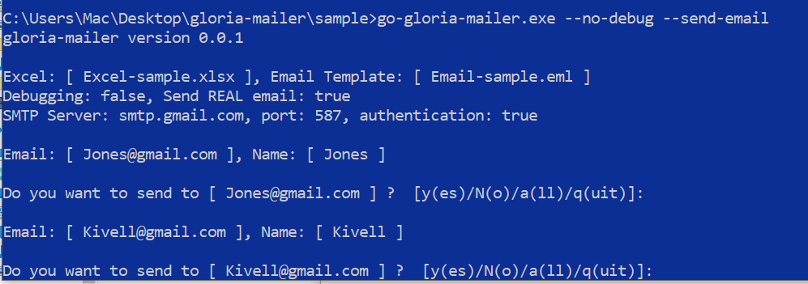
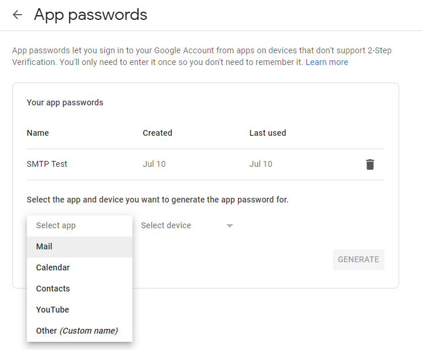
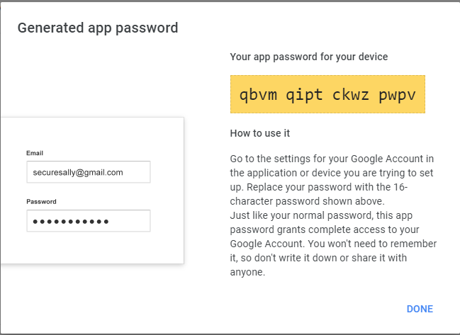

# Gloria Mailer

這裡是提供使用範例，包括一個執行檔。我第一次在 github 上放執行檔，不確定是否有違反規定

```shell
$ sha256sum go-gloria-mailer.exe 
48ec9c65db08f80b4fdf2cb62863a3bcdf9ba4a11d1ccfcd8a249e7ad6b2f2c3  go-gloria-mailer.exe
```

請先修改 settings.conf 檔，用 Notepad 就可以了。
在 CMD 下執行，以下是加了 --help 的參數時的畫面，同時可以看到一些選項。基本上，
設定檔是必要的，而部份設定可以用參數方式強迫指定。 



程式是 interactive 的方式，一筆一筆資料問。問的時候有 y(es)|N(o)|a(ll)|q(uit)
的提示，yes 是執行寄出，no 是不寄，all 是不要再問了，全寄，q 是不要再問了，程式退出。
no 是 default, (所以 N 大寫)



使用 Gmail 建議申請 App 密碼，申請畫面如下。



這個是 App 密碼產生成功的畫面

